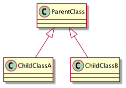
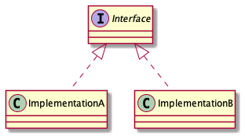
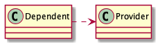

# UML - Class Diagram

Let's start the class diagram from the high level, and we will dig into the low level.

At high-level there are two things we can see-

* Class block - The Box Shape
* The connecting line among the class

Based on the line type, we can figure how the entities are connected.
Let's first go through different type line types for the relation type.

## Connector for different type relationship

### 1. Unfilled arrowhead with a solid line for Inheritance



The direction of the arrow is from the child class to the parent class. The child class is just a specific type of
parent class and can be replaced with one another.

### 2. Unfilled arrowhead with a broken line for Interface-Implementation



This arrow is used to show interface implementation. The direction is from the implementation class to the interface.

## 3. Filled arrowhead with a solid line for Strong association


```java
class Dependent {
    Provider provider;

    Dependent(Provider provider) {
        this.provider = provider;
    }
}

class Provider { }
```

In the code snippet, the `Dependent` class is storing a reference of `Provider` class. So the `Dependent` and the
`Provider` class have a strong association.

The direction of the arrow is from the **dependent** to the **dependee**.

> Note: Sometimes you will also see association without any arrow.

## 4. Filled arrowhead with a broken line for Dependency




```java
class Dependent {
    public void someMethod(Provider provider) {}
}

class Provider { }
```

A dependency is much weaker than an association. Similar to the association, the direction of the arrow is from the
**dependent** to the **dependee**.

In the example code above, the provider class is passed via a method. However, there are other ways the `Dependent`
class could depend on the `Provider` class.

 * When Dependent class raises or catches `exception` of type Provider
 * Whenever the Provider class is modified, the Dependent class needs to be modified.
 * The dependent class calls a static method from the Provider class.

> Note: Sometimes you will also see association without any arrow.

## 5. Specific type of association connector

### 5.1. Aggregation - Loose Coupling

The aggregation association mostly means there is a loose coupling between the two entities. For example, from the
previous code snippet, the `Payment` class can still exist if we remove the `Checkout` class.

In this relationship, the diamond-shaped arrowhead is not filled and attached to the parent entities. Here, the
`Checkout` class is the parent class, and the `Payment` class is the child class.

### 5.2. Composition - Tight Coupling

This association means that there is a tight coupling between two entities. For example, we cannot remove either `x` or
`y` classes and keep the other.

Here the diamond shape is filled. Similar to the aggregation, the diamond shape is attached with the parent entities.
The `x` class is the parent from the code snippet, and `y` class is the child class.