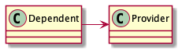

# UML - Class Diagram

Let's start the class diagram from the high level, and we will dig into the low level.

At high-level there are two things we can see-

* Class block - The Box Shape
* The connecting line among the class

Based on the line type, we can figure how the entities are connected.
Let's first go through different type line types for the relation type.

## Connector for different type relationship

### 1. Solid arrow line for Inheritance


The direction of the arrow is from the child class to the parent class. The arrowhead is unfilled. The child class is
just a specific type of parent class and can be replaced with one another.

### 2. Broken arrow line for Interface-Implementation class


This arrow is used to show interface implementation. The direction is from the implementation class to the interface,
and the arrowhead is unfilled.

## 3. Broken arrow line for Dependency

When a class interacts with another via method but the object is not stored in any instance field. In this case, the
direction of the arrow is from the **dependent** to the **dependee**.

> Note that the arrow head is different from the relation inheritance and the implementation.


## 4. Solid arrow/line for Strong association



```java
class CheckOut {
    Payment payment;

    CheckOut(Payment payment) {
        this.payment = payment;
    }
}

class Payment {

}
```

If you look closely, the arrowhead is different from the inheritance arrow. The direction of the arrow is from the
**dependent** to the **dependee**. In the example, the dependent is the `CheckOut` class, and the `Payment` class is the
dependee.

Sometimes you will also see association without any arrow.

## 5. Specific type of association connector

### 5.1. Aggregation - Loose Coupling

The aggregation association mostly means there is a loose coupling between the two entities. For example, from the
previous code snippet, the `Payment` class can still exist if we remove the `Checkout` class.

In this relationship, the diamond-shaped arrowhead is not filled and attached to the parent entities. Here, the
`Checkout` class is the parent class, and the `Payment` class is the child class.

### 5.2. Composition - Tight Coupling

This association means that there is a tight coupling between two entities. For example, we cannot remove either `x` or
`y` classes and keep the other.

Here the diamond shape is filled. Similar to the aggregation, the diamond shape is attached with the parent entities.
The `x` class is the parent from the code snippet, and `y` class is the child class.