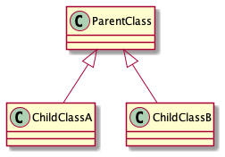

# UML - Class Diagram

Let's start the class diagram from the high-level, and we will dig into low level.

On high-level there is two things we can see-

* Class block - The Box Shape
* Connecting line among the class

Based on the line type we can figure how the entities are connected with each other. Let's first go thorough different
type line type for the relation type.

## Connector for different type relationship

### 1. Solid arrow line for Inheritance



The direction of the arrow is from child class to parent class. The arrow head is unfilled. Just to put emphasis, the
child class is just a specific type of parent class and can be replaced with one another.

### 2. Broken arrow line for Interface-Implementation class


This arrow is used to show interface implementation. The arrow direction is from the implementation class to interface.
The arrow head is unfilled.

## 3. Arrow for association


```java
class CheckOut {
    Payment payment;

    CheckOut(Payment payment) {
        this.payment = payment;
    }
}

class Payment {

}
```

If you look closely the arrow head is different from the inheritance arrow. The direction of the arrow is from the 
**dependent** to **dependee**. In the example, dependent is the `CheckOut` class and `Payment` class is the dependee.