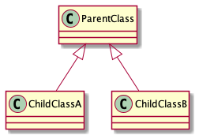
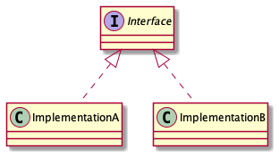
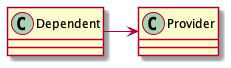
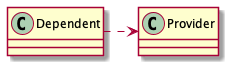
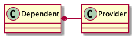
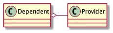

At the high level, there are two things we can see in the UML class diagram-

* Class block - The Box Shape
* The connecting line among the classes

Based on the line type, we can figure how the entities are connected.
Let's go through different type line types for the relation type.

## Connector for different type relationship

### 1. Unfilled arrowhead with a solid line for Inheritance



The direction of the arrow is from the child class to the parent class. The child class is just a specific type of
parent class and can be replaced with one another.

### 2. Unfilled arrowhead with a broken line for Interface-Implementation



This arrow is used to show interface implementation. The direction is from the implementation class to the interface.

## 3. Filled arrowhead with a solid line for Strong association



```java
class Dependent {
    Provider provider;

    Dependent(Provider provider) {
        this.provider = provider;
    }
}

class Provider { }
```

In the code snippet, the `Dependent` class is storing a reference of the `Provider` class. So the `Dependent` and the
`Provider` class have a strong association.

The direction of the arrow is from the **dependent** to the **dependee**.

> **Note**: Sometimes, you will also see association without any arrow.

## 4. Filled arrowhead with a broken line for Dependency




```java
class Dependent {
    public void someMethod(Provider provider) {}
}

class Provider { }
```

A dependency is much weaker than an association. Similar to the association, the direction of the arrow is from the
**dependent** to the **dependee**.

In the example code above, the provider class is passed via a method. However, there are other ways the `Dependent`
class could depend on the `Provider` class.

 * When Dependent class raises or catches an **exception** of type Provider
 * Whenever the Provider class is modified, the Dependent class needs to be modified.
 * The dependent class calls a static method from the Provider class.

> **Note**: Sometimes, you will also see association without any arrow.

## 5. Specific type of association connector

### 5.1. Solid line with a filled diamond for Composition



The filled diamond shape is placed with the dependent entity.

Composition means The Dependent class **owns**  the Provider class. Therefore, the Provider class cannot exist or has no
meaning without the Dependent class.

For example, the relationship between a building and rooms is a type of Composition.

### 5.2. Solid line with an unfilled diamond for Aggregation



The unfilled diamond shape is placed with the dependent entity.

Aggregation means the Dependent class **uses** the Provider class.
The Provider class exists independently (conceptually) from the Dependent class.

For example, The relationship between a Company and People is a type of Aggregation.
